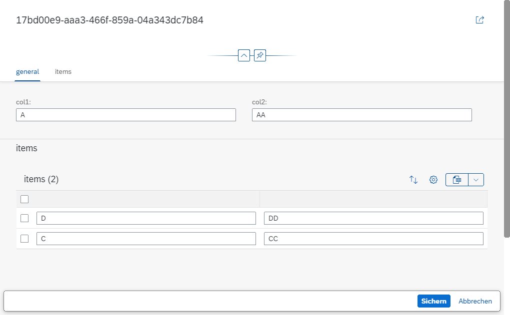

# problem

It is not possible to create new/delete entries in a table of the object page.

# quicklinks

- [$metadata](./srv/$metadata.xml)
- [db cds file](./db/schema.cds)
- [srv cds file](./srv/service.cds)
- [app cds file](./app/project1/fiori-service.cds)
- [app manifest file](./app/project1/webapp/manifest.json)

# approaches

- [Adding Actions to Tables](https://sapui5.hana.ondemand.com/1.92.2/#/topic/b623e0bbbb2b4147b2d0516c463921a0)
- [Generic Action Buttons in Tables on the Object Page: Additional Considerations](https://sapui5.hana.ondemand.com/1.92.2/#/topic/d27ae998a20a4dbead161e3e7c0ac2e8)
- [Controlling the Editability of Sections](https://sapui5.hana.ondemand.com/1.92.2/#/topic/5c8763f0fb1f4cc7aaab6cc19d5ee45c)
- [Fiori Elements Object Page - Table Create Button missing](https://answers.sap.com/questions/12946084/fiori-elements-object-page-table-create-button-mis.html) => I am a bit confused here, is the pages approach still up to date?

# bonus question
- In the screenshot above, items can be seen twice. According to the instructions [Defining and Adapting Sections -> Tip](https://sapui5.hana.ondemand.com/1.92.2/#/topic/facfea09018d4376acaceddb7e3f03b6.html), it should only be displayed once if it has the same name.
- Is it possible to disable drafts for some special cases? I think in the past it also worked without drafts, I would have to search in my archives. (For example, after removing [odata draft](./srv/service.cds), the creation no longer works)